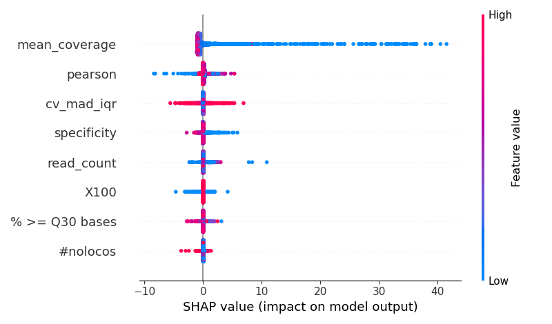

# Gradient Boosted Regressor for CNV Analysis

This script is designed to train a Gradient Boosted Regressor model to identify the features that contribute to high CNV numbers in a sample. High CNV numbers are likely to be false positives, and this model aims to capture those features.

## Dependencies

To run this script, you'll need the following Python libraries:
- pandas
- numpy
- scikit-learn
- seaborn
- matplotlib
- pickle
- shap

You can install these dependencies using pip:
```
pip install pandas numpy scikit-learn seaborn matplotlib pickle shap
```

## Features

The script performs the following operations:
- Loads and preprocesses the data.
- Trains a Gradient Boosted Regressor model using GridSearchCV for hyperparameter tuning.
- Evaluates the model's performance using metrics like R-squared, Mean Absolute Error, Mean Squared Error, and Root Mean Squared Error.
- Plots the model fit, feature importance, and SHAP values.
- Saves the trained model to a file named `gradient_model.pkl`.

## Usage

To run the script, simply execute:
```
python gradient_boost.py
```

## Output

The script will generate and save the following plots:
- Feature importance plot named `feature_importances.png`.
- SHAP values plot named `shap_plot.png`.

Additionally, the trained model will be saved as `gradient_model.pkl`.

## Feature Importances


## SHAP Plot


